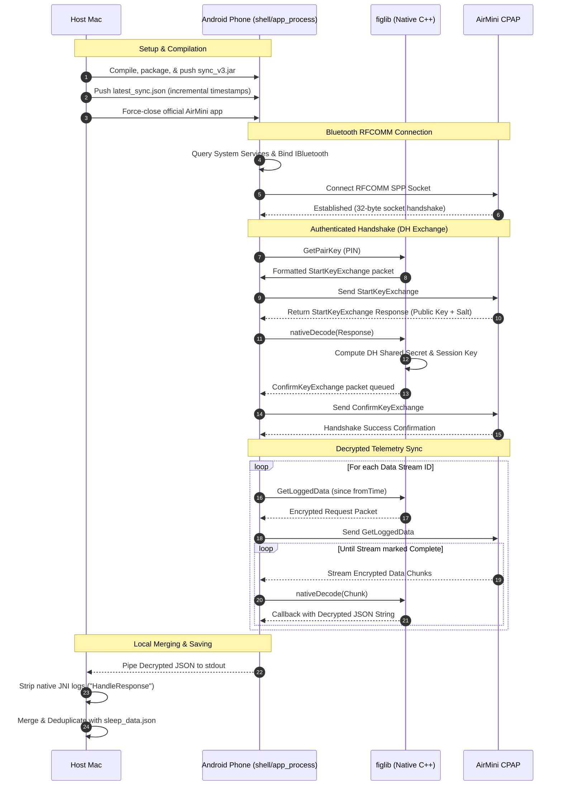

# On-Device AirMini Bluetooth Sync

We have transitioned the Bluetooth connection logic to run directly on your Android phone. This completely bypasses macOS RFCOMM virtual serial port issues.

## Sync Architecture & Data Flow



---

## How it works

### 1. Direct-Binder Bluetooth Connection

Since the runner executes via `app_process` under the `shell` user, standard Android APIs like `BluetoothAdapter.getDefaultAdapter()` return `null` (due to the lack of an initialized application context/looper). 

To solve this, the Java agent:

- Obtains the lower-level `"bluetooth_manager"` service binder from the system `ServiceManager`.
- Construct a dynamic Java proxy to implement the hidden `IBluetoothManagerCallback` interface.
- Calls `registerAdapter()` on the manager using the proxy to obtain the main `IBluetooth` adapter binder.
- Builds an `AttributionSource` representing the `com.android.shell` package (UID 2000) using reflection.
- Queries `getBondedDevices(attributionSource)` on the `IBluetooth` service to discover the bonded CPAP machine.
- Retrieves the `IBluetoothSocketManager` service and calls `connectSocket(...)` directly, returning a raw socket `ParcelFileDescriptor` for the RFCOMM SPP channel.

### 2. On-Device Encryption/Decryption

Instead of routing packets back and forth between the Mac and the phone for encryption, all data encoding/decoding happens directly on the phone inside the JVM process using the JNI C++ library (`/data/local/tmp/libfiglib.so`). Decrypted telemetry streams are printed to stdout and saved directly to the Mac.

---

## Sync Instructions

### Step 1: Put the AirMini in Pairing Mode

Before starting, ensure the AirMini's Bluetooth module is actively listening:

1. Locate the **physical Bluetooth button** on your ResMed AirMini machine.
2. Press and hold the button until the **blue LED starts flashing**.

### Step 2: Run the Sync Script

Once the blue LED is flashing, run the sync helper on your Mac:

```bash
./run_sync.sh <4-digit-pin-for-resmed-airmini>
```

This script will:

1. Force-stop the official AirMini app (releasing its Bluetooth socket lock).
2. Scan for existing synchronized timestamps in `sleep_data.json` to perform a **smart incremental sync** (only downloading new records).
3. Connect, execute the pairing handshake, download, decrypt, and merge new data blocks.

---

## Telemetry Utilities

### 1. View Therapy Statistics

To compile and view therapy statistics (mask sessions, total duration, leak percentiles, and respiratory event distributions), run the stats tool on your Mac:

```bash
./stats.py [optional_path_to_json]
```

*(By default, it will parse `sleep_data.json` in the current directory).*

### 2. Prune Historical Data

If the machine contains stale factory-test records or you only want to focus on data after a certain date (e.g. 1st Jan 2026), run the pruning script:

```bash
./prune.py 2026-01-01 [optional_path_to_json]
```

This filters out all database entries prior to your cutoff date and automatically writes a backup file to `sleep_data.json.bak` before saving the pruned output.